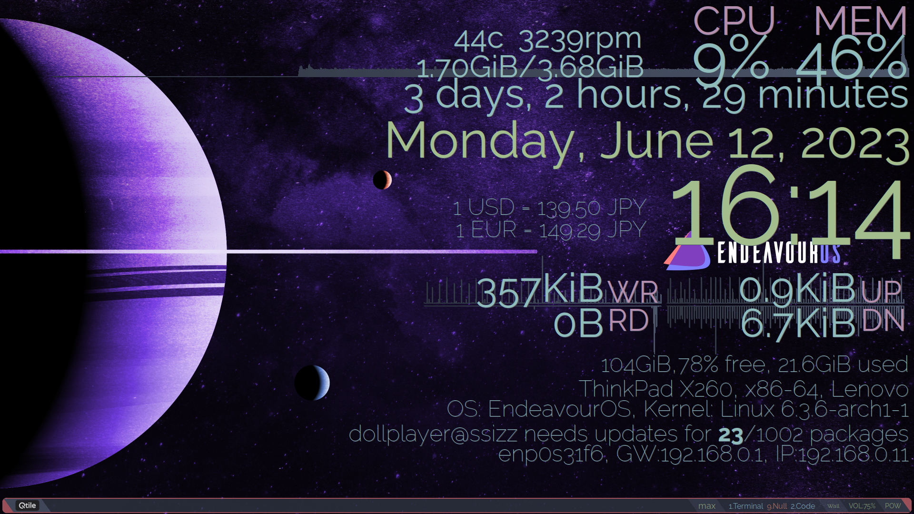
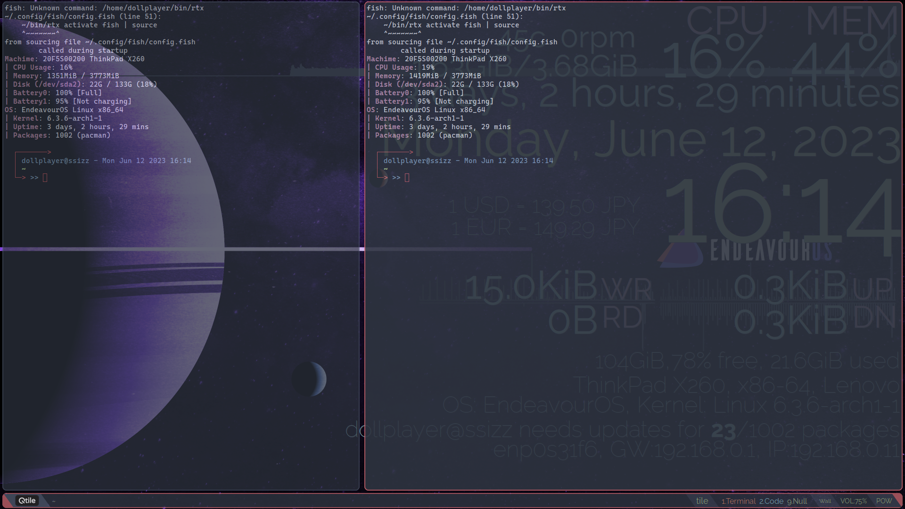
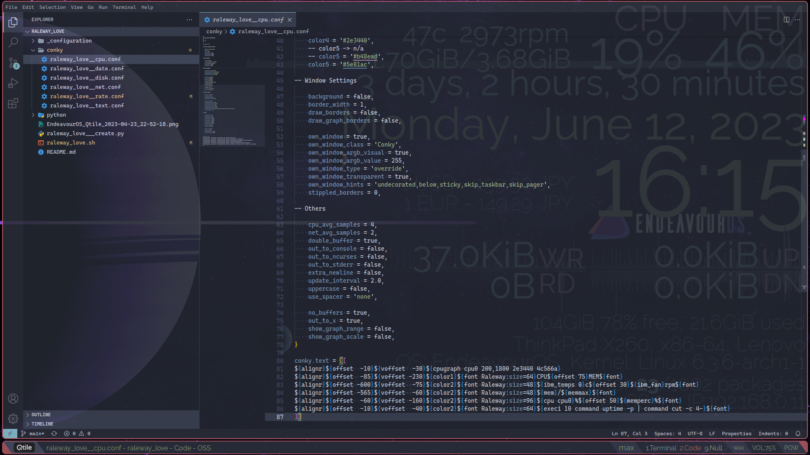
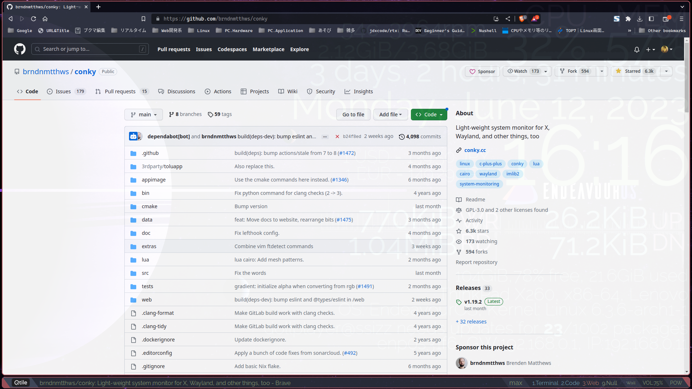
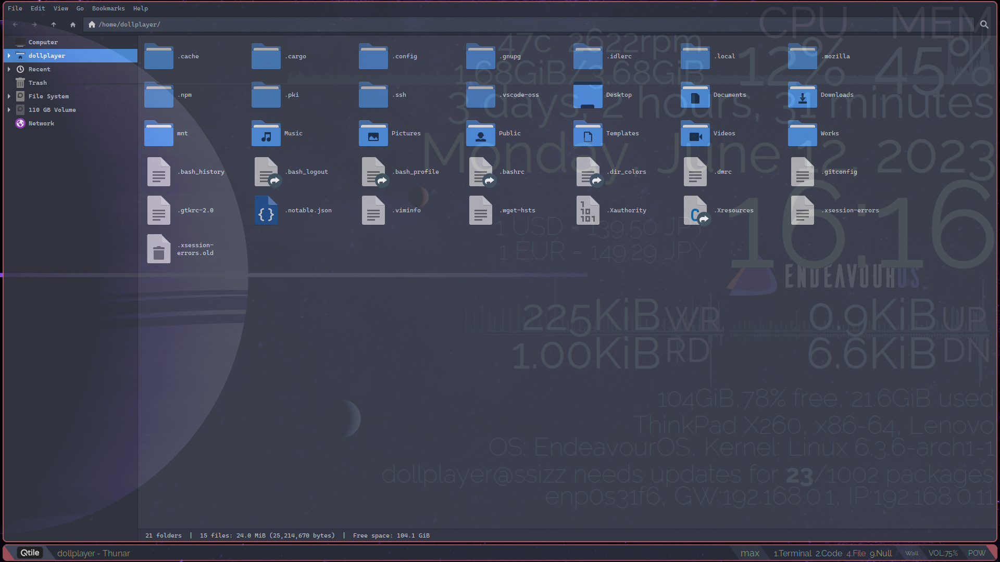

# Conky theme 'Raleway love'

 

 

This is my first Conky theme.

__Why is it so big ?__

Because I have 2 reasons and/or purposeses.

1. I use tiling window manager and the transparent window by picom.
2. When I look at the display, I only need to know the current time though the transparent window.

No one creates a theme like this, so I don't think there is a demand for it, but I use it normally.

## Requirements

1. Raleway font
2. Not using Lua
3. Python and its json and yaml, feedparser library, for aggressive customization, see below

## Installation help

This theme is assumed to be placed under `~/.config/conky/`, then start `./raleway_love.sh`.

## For aggressive customization

### overview

Instead of modifying `./conky/raleway_love__*.conf`, I **recommend** modifying the following files and generation `./conky/raleway_love__*.conf` by `./raleway_love___create.py`.

- `./_configuration/conf/raleway_love___base_config.conf`
- `./_configuration/json/raleway_love___graph_color.json`
- `./_configuration/template/raleway_love___template.conf`
- `./_configuration/yaml/raleway_love___*.yaml`

### View currency rate

See `./python/raleway_love__rate.py`.

## Todo

I would like to rewrite Lua, but I don't have the skills to implement the graphs.  
If I rewrite it, I plan to use [philer/polycore](https://github.com/philer/polycore).

